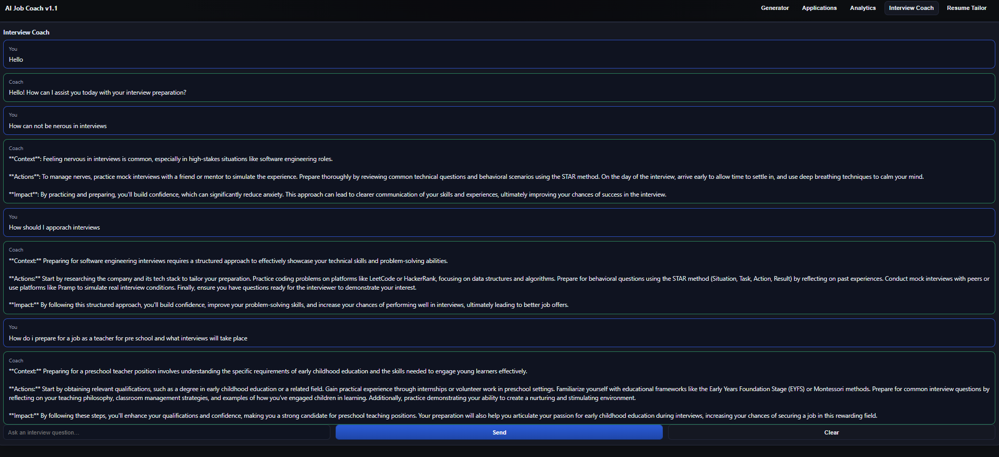

# AI-Smart Job Application Tracker & Interview Coach

A cloud-native web app that helps users **manage job applications**, **track progress**, and get **AI-powered personalized interview preparation**, now with **real-time internship job listings** from top companies.

## 🎯 Features
- **Resume & cover letter tailoring** powered by GPT
- **Job application tracker** with multi-step progress tracking
- **Mock interview generator** with chatbot-style Q&A
- **Analytics dashboard** (e.g., application success rate, stage distribution)
- **Real-time software engineering internship jobs** fetched from Lever & Greenhouse APIs
- **OAuth2-based authentication** for secure login
- **PostgreSQL + Redis backend** for persistent and cached data
- **Fully containerized** and deployable with Docker & Terraform

## 📷 Screenshots

<p align="center">
  <figure>
    
    <figcaption><b>Job Tracker</b></figcaption>
  </figure>
  <figure>
    
    <figcaption><b>Interview Coach</b></figcaption>
  </figure>
  <figure>
    
    <figcaption><b>Real-Time Jobs</b></figcaption>
  </figure>
</p>


## 🧱 Tech Stack

| Layer           | Technology                               |
|-----------------|------------------------------------------|
| Frontend        | React + TypeScript + Tailwind CSS         |
| Backend         | FastAPI (Python)                          |
| Database        | PostgreSQL + Redis (cache)               |
| AI/ML           | OpenAI / PaLM API                         |
| DevOps          | Docker, Kubernetes, GitHub Actions        |
| Infra           | Terraform (AWS/GCP)                       |
| Auth & Security | OAuth2, JWT, HTTPS, encryption            |

## 📂 Monorepo Structure
```
/frontend   # React + TypeScript client
/backend    # FastAPI backend, job fetchers, API routes
```

## 🚀 Getting Started

1. **Clone the repo**
```bash
git clone https://github.com/SandeepMishra02/ai-job-coach.git
cd ai-job-coach
```

2. **Setup backend**
```bash
cd backend
pip install -r requirements.txt
uvicorn main:app --reload
```

3. **Setup frontend**
```bash
cd frontend
npm install
npm run dev
```

4. **Open in browser**
```
Frontend: http://localhost:5173
Backend API: http://localhost:8000
```

---
**Author:** Sandeep Mishra  
**License:** MIT


