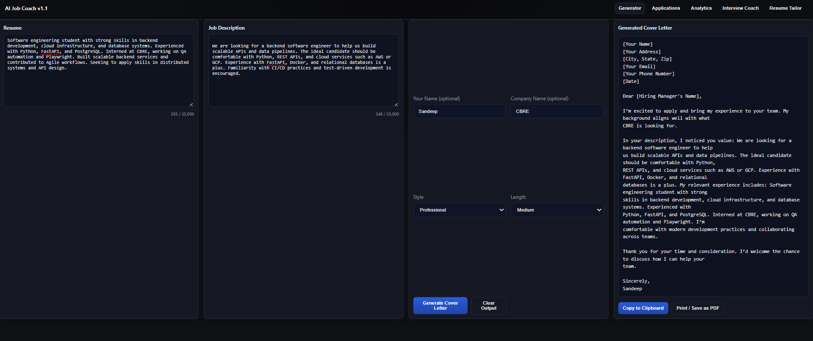
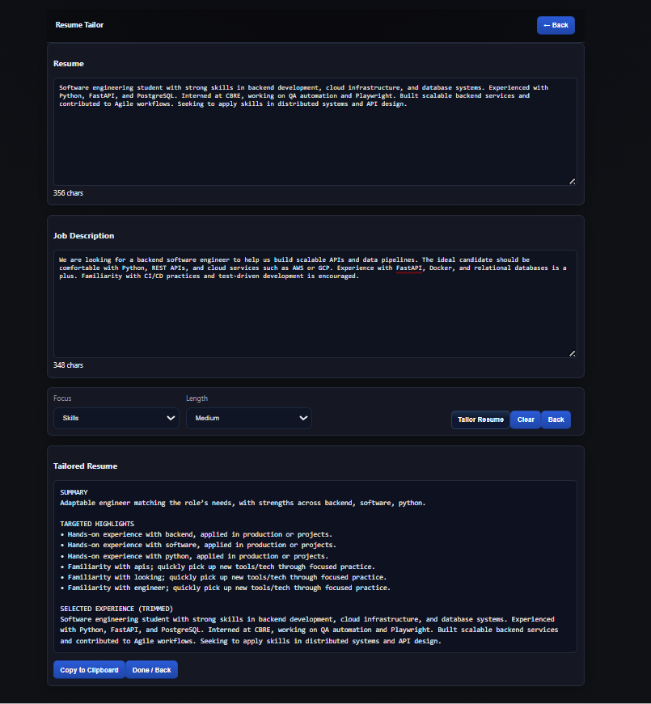

# AI-Smart Job Application Tracker & Interview Coach

A cloud-native web app that helps users manage job applications, track progress, and prepare for interviews with AI-powered personalization. Designed to streamline the job hunt with tailored resumes, mock interviews, and real-time analytics.

---

## 🎯 Features
- **AI-Driven Resume & Cover Letter Tailoring** – Generates customized resumes and cover letters using GPT based on the specific job description.
- **Interactive Mock Interview Coach** – Simulates interview scenarios with chatbot-style Q&A, offering feedback and preparation tips.
- **Job Application Tracker** – Manage applications across multiple stages and get success-rate insights.
- **Analytics Dashboard** – Visualize application progress and identify trends to improve your chances.
- **Secure User Authentication** – OAuth2 + JWT for login and session management.
- **Scalable Backend & Infra** – Built with FastAPI, PostgreSQL, Redis, Docker, and Terraform for cloud deployment.

---

## 📸 Screenshots

**Interview Coach**  


**Cover Letter Generator**  


**Resume Tailor**  


---

## 🧱 Tech Stack

| Layer           | Technology                              |
|-----------------|-----------------------------------------|
| Frontend        | React + TypeScript + Tailwind CSS       |
| Backend         | FastAPI                                 |
| Database        | PostgreSQL + Redis (cache)              |
| AI/ML           | OpenAI / PaLM API                       |
| DevOps          | Docker, Kubernetes, GitHub Actions      |
| Infra           | Terraform (AWS/GCP)                     |
| Auth & Security | OAuth2, JWT, HTTPS, encryption          |

---

## 📂 Monorepo Structure
```
frontend/    # React + Tailwind frontend
backend/     # FastAPI backend
data.db      # SQLite/PostgreSQL data storage
```

---

## 🚀 Getting Started

1. **Clone this repo**
```bash
git clone https://github.com/SandeepMishra02/ai-job-coach.git
cd ai-job-coach
```

2. **Install dependencies**
```bash
# Backend
cd backend
pip install -r requirements.txt

# Frontend
cd frontend
npm install
```

3. **Run the app**
```bash
# Backend
uvicorn main:app --reload

# Frontend
npm run dev
```

4. **Open in browser**  
Visit `http://localhost:3000` to view the app.

---

## 📜 License
This project is licensed under the MIT License – see the [LICENSE](LICENSE) file for details.


